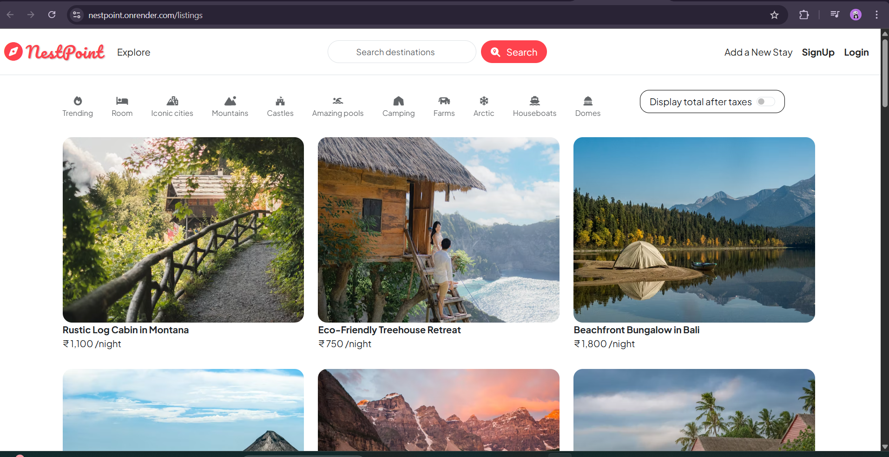

# 🏠 NestPoint – Full-Stack Property Rental Web App (Airbnb Clone)

A full-stack rental application where users can browse, list, and manage rental properties — inspired by Airbnb, built with MERN Stack.

---

## 🔗 📌Live Demo

🌍 [Visit Live App](https://nestpoint.onrender.com)

---

## 🔧 Tech Stack

- **Frontend**: EJS, Bootstrap 5, HTML/CSS  
- **Backend**: Node.js, Express.js  
- **Database**: MongoDB, Mongoose  
- **Authentication**: Passport.js, bcrypt, express-session  
- **Utilities**: connect-flash, method-override, ejs-mate  

---

## ✨ Features

- 🔐 **User Authentication** – Register, login, logout (Passport.js)
- 🧑‍💼 **Role-Based Access** – Only owners can edit/delete their listings
- 📄 **Listings CRUD** – Add, update, delete listings with validation
- ⚠️ **Flash Messages** – Real-time feedback for user actions
- 🧱 **Custom Middleware** – `isLoggedIn`, `isOwner` authorization checks
- 🔁 **Redirect After Login** – Return to the intended page after login
- 💾 **Session Management** – Cookie-based secure login persistence
- 🚫 **Central Error Handling** – Clean error pages and messages
- 🌱 **Demo Seed Data** – Pre-loaded listings for quick testing
- 💻 **Responsive UI** – Clean Bootstrap layout

---

## 🖼️ Screenshots

### 🏠 Home Page  


### 🔐 Login Page  


### 📝 Sign-Up Page  


### ➕ Creating New Listing  


### 🗺️ Map View  


---

## 🌟 Support This Project

If you found this project helpful or interesting:

- ⭐ **Star this repository** on GitHub — it helps others discover it!
- 🐛 Found a bug? [Open an issue](https://github.com/your-username/MajorProject/issues)
- 📥 Want to contribute? Pull requests are welcome!

Thank you for checking out **NestPoint** 🙌


## 🚀 Getting Started

### 1. Clone the repo
```bash
git clone https://github.com/Manjot-git/MajorProject.git
cd nestpoint


